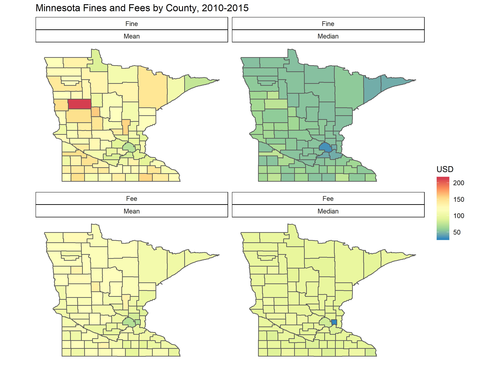

```{r packages_data, include=FALSE}
#packages and data
#packages

library(readr)
library(dplyr)
library(ggplot2)
library(lme4)
library(lmerTest)
library(stargazer)
library(car)
library(stringr)
library(ggthemes)
library(tidyr)

#load data - constructed from MCAO .txt files
monsanc <- read_csv("~/MonSanc/monsanc.csv") 

#recoding and filtering
monsanc.short <- monsanc %>%
  mutate(total_ff = total_ff*adj, #adjust dollars to Jan. 2018
         total_ff_stand = scale(total_ff),
         total_ff_log = log((total_ff+1)), #log+1 DV
         min_perc = (min_pop/total_pop)*100,
         black_perc = (black_pop/total_pop)*100,
         hisp_perc = (hisp_pop/total_pop)*100, 
         na_perc = (na_pop/total_pop)*100) %>%
  filter(file_year >= 2010) #restricting to cases started from 2010-2015

#make factors into binary indicators to match analyses/tables from paper
monsanc.short <- monsanc.short %>% 
  mutate(charge_degree = ifelse(charge_degree=="converted"|charge_degree=="other", NA, charge_degree),
         felony = ifelse(charge_degree=="felony", 1, 0), 
         gross.mis = ifelse(charge_degree=="gross misdemeanor", 1, 0),
         mis = ifelse(charge_degree=="misdemeanor", 1, 0),
         petty.mis = ifelse(charge_degree=="petty misdemeanor", 1, 0),
         white = ifelse(race_impute=="white", 1, 0),
         asian = ifelse(race_impute=="asian", 1, 0),
         black = ifelse(race_impute=="black", 1, 0),
         hispanic = ifelse(race_impute=="hispanic", 1, 0),
         nativeam = ifelse(race_impute=="nat. am.", 1, 0),
         other.race = ifelse(race_impute=="other", 1, 0),
         violent = ifelse(charge_offense=="violent", 1, 0),
         alcohol.dui = ifelse(charge_offense=="alcohol/dui", 1, 0),
         drug = ifelse(charge_offense=="drug", 1, 0),
         hunt.fish = ifelse(charge_offense=="hunt/fish", 1, 0),
         other.offense = ifelse(charge_offense=="other", 1, 0),
         male = ifelse(gender_impute=="M", 1,0)) %>%
  filter(age >= 15) #filtering cases with likely error ages (n=620)

#felony filter
felony <- monsanc.short %>% filter(charge_degree=="felony")

#merge in mnsg data
mnsg <- read_csv("~/MonSanc/msgc_severity_crimhistory.csv")
felony <- felony %>% left_join(mnsg, by = c("current_case_number"="dcnum_conv"))

#dropping missing for ML model building
felony <- felony %>% 
  drop_na(black,hispanic,asian,nativeam,other.race,male,age,histall,
          severity_conv,prison,trial_flag,
              drug,alcohol.dui,other.offense, min_perc,repubvote,lecperc)


```

#Context 

##LFOs as Punishment

### National - Harris et.al. 2010

- Proliferation of LFO imposition 
- Substantial legal debt relative to defendant financial status
- key cog in the reproduction of inequality

### Minnesota - 5 LFO components

- base fine
- criminal surcharge
- law library fee
- post-court fees (e.g., probation fees, restitution)
- other court fees (e.g., PD co-pay)


## Total LFOs over time

```{r, echo=F}
ovr.year.level <- monsanc %>% 
  select(case_mkey, filed_county, file_year, 
         fine_ordered, fee_ordered, rest_ordered,
         total_order, total_ff, adj) %>% 
  group_by(file_year) %>% 
  summarise(fine_mu = mean(fine_ordered*adj, na.rm = T),
            fine_med = median(fine_ordered*adj, na.rm = T),
            fee_mu = mean(fee_ordered*adj, na.rm = T),
            fee_med = median(fee_ordered*adj, na.rm = T), 
            rest_mu = mean(rest_ordered*adj, na.rm = T),
            rest_med = median(rest_ordered*adj, na.rm = T),
            total_mu = mean(total_order*adj, na.rm = T), 
            total_med = median(total_order*adj, na.rm = T),
            total_ff_mu = mean(total_ff*adj, na.rm = T), 
            total_ff_med = median(total_ff*adj, na.rm = T),
            total_order_mu = mean(total_order*adj, na.rm = T),
            total_order_med = median(total_order*adj, na.rm = T),
            count = n()) %>% 
  filter(file_year >= 2010) %>%
  select(starts_with("total_order"), file_year, count) %>%
  rename(total.order_mu = total_order_mu,
         total.order_med = total_order_med) %>%
  gather(key = "key", value="value", -file_year, -count) %>%
  separate(key, into = c("type","stat"), sep="_") %>%
  mutate(stat = case_when(
    stat=="mu" ~ "Mean",
    stat=="med" ~ "Median"
  ),
  type = str_to_title(type))

ggplot(ovr.year.level, aes(x = file_year, y = value))+
  geom_line(color="black")+
  geom_point(aes(size=count), color="green")+
  scale_x_continuous(breaks = seq(2010,2015,2))+
  facet_grid(~stat)+
  labs(title = "Minnesota LFOs by Year",
          caption = "Note: Adjusted to Jan. 2018 dollars", 
       y = "USD",
       x = "Year",
       size="N")+
  theme_classic()+
  guides(color=F)
```

## Fines and fees over time
```{r, echo=F}
year.level <- monsanc %>% 
    select(case_mkey, filed_county, file_year, 
           fine_ordered, fee_ordered, rest_ordered,
           total_order, total_ff, adj) %>% 
    group_by(file_year) %>% 
    summarise(fine_mu = mean(fine_ordered*adj, na.rm = T),
              fine_med = median(fine_ordered*adj, na.rm = T),
              fee_mu = mean(fee_ordered*adj, na.rm = T),
              fee_med = median(fee_ordered*adj, na.rm = T), 
              rest_mu = mean(rest_ordered*adj, na.rm = T),
              rest_med = median(rest_ordered*adj, na.rm = T),
              total_mu = mean(total_order*adj, na.rm = T), 
              total_med = median(total_order*adj, na.rm = T),
              total_ff_mu = mean(total_ff*adj, na.rm = T), 
              total_ff_med = median(total_ff*adj, na.rm = T),
              total_order_mu = mean(total_order*adj, na.rm = T),
              total_order_med = median(total_order*adj, na.rm = T),
              count = n()) %>% 
    filter(file_year >= 2010) %>%
    select(-starts_with("total")) %>%
    gather(key = "key", value="value", -file_year, -count) %>%
    separate(key, into = c("type","stat"), sep="_") %>%
    mutate(stat = case_when(
      stat=="mu" ~ "Mean",
      stat=="med" ~ "Median"
    ),
    type = str_to_title(type),
    type = factor(type, levels = c("Fine", "Fee", "Rest")))
  
year.ff <- year.level %>% filter(!type=="Rest") 
  
ggplot(year.ff, aes(x = file_year, y = value, color=type))+
    geom_line(color="black")+
    geom_point(aes(size=count))+
    scale_x_continuous(breaks = seq(2010,2015,2))+
    facet_grid(~type+stat)+
    labs(title = "Minnesota Fines and Fees by Year",
         caption = "Note: Adjusted to Jan. 2018 dollars", 
         y = "USD",
         x = "Year",
         size="N")+
    theme_classic()+
    guides(color=F)
```

## Fines and fess by County



```{r, include = F, eval=F}

# This won't work due to lack of package support on linux server
# made plots locally and embedded .png file
load("~/MonSanc/ASR Replication/Minnesota-ASR-Replication/ASC 19/mn.RData")

c.level <-monsanc %>% filter(file_year >= 2010) %>%
  select(case_mkey, filed_county, file_year, 
         fine_ordered, fee_ordered, rest_ordered,
         total_order, total_ff, adj) %>% 
  group_by(filed_county) %>% 
  summarise(fine_mu = mean(fine_ordered*adj, na.rm = T),
            fine_med = median(fine_ordered*adj, na.rm = T),
            fee_mu = mean(fee_ordered*adj, na.rm = T),
            fee_med = median(fee_ordered*adj, na.rm = T), 
            rest_mu = mean(rest_ordered*adj, na.rm = T),
            rest_med = median(rest_ordered*adj, na.rm = T),
            total_mu = mean(total_order*adj, na.rm = T), 
            total_med = median(total_order*adj, na.rm = T),
            total_ff_mu = mean(total_ff*adj, na.rm = T), 
            total_ff_med = median(total_ff*adj, na.rm = T),
            total_order_mu = mean(total_order*adj, na.rm = T),
            total_order_med = median(total_order*adj, na.rm = T),
            count = n()) %>%
  select(-starts_with("total")) %>%
  gather(key = "key", value="value",-filed_county, -count) %>%
  separate(key, into = c("type","stat"), sep="_") %>%
  mutate(stat = case_when(
    stat=="mu" ~ "Mean",
    stat=="med" ~ "Median"
  ),
  type = str_to_title(type),
  type = factor(type, levels = c("Fine", "Fee", "Rest")))

county <- c.level %>% left_join(mn, by = c("filed_county"="county"))
county.ff <- county %>% filter(!type=="Rest")
```

```{r, echo=F, eval=F}
ggplot(county.ff, aes(geometry = geometry, fill=value.x)) +
  geom_sf() + 
  #coord_sf(crs=2163)+ # Albers equal area.
  scale_fill_distiller(palette = "Spectral",
                      name = "USD") +
  facet_wrap(~type+stat)+
  ggtitle("Minnesota Fines and Fees by County, 2010-2015")+
  theme(axis.text = element_blank(),
  axis.line = element_blank(),
  axis.ticks = element_blank(),
  panel.border = element_blank(),
  panel.grid = element_blank(),
  axis.title = element_blank(),
  panel.background = element_blank(),
  panel.grid.major = element_line(colour="transparent"), #Removes graticule lines
  plot.subtitle = element_text(face="italic"),
  strip.background = element_rect(fill = "white", 
                colour = "black"))
```

## Fines and fees by race
```{r, include=FALSE}
#case-level
race <-  monsanc %>% 
  select(case_mkey, race_impute, file_year, 
         fine_ordered, fee_ordered, rest_ordered,
         total_order, total_ff, adj) %>% 
  filter(!is.na(race_impute)) %>%
  group_by(race_impute, file_year) %>% 
  summarise(fine_mu = mean(fine_ordered*adj, na.rm = T),
            fine_med = median(fine_ordered*adj, na.rm = T),
            fee_mu = mean(fee_ordered*adj, na.rm = T),
            fee_med = median(fee_ordered*adj, na.rm = T), 
            rest_mu = mean(rest_ordered*adj, na.rm = T),
            rest_med = median(rest_ordered*adj, na.rm = T),
            total_mu = mean(total_order*adj, na.rm = T), 
            total_med = median(total_order*adj, na.rm = T),
            total_ff_mu = mean(total_ff*adj, na.rm = T), 
            total_ff_med = median(total_ff*adj, na.rm = T),
            total_order_mu = mean(total_order*adj, na.rm = T),
            total_order_med = median(total_order*adj, na.rm = T),
            count=n()) %>%
  filter(file_year >= 2010) %>%
  select(-starts_with("total")) %>%
  gather(key = "key", value="value", -file_year, -count, -race_impute) %>%
  separate(key, into = c("type","stat"), sep="_") %>%
  mutate(stat = case_when(
    stat=="mu" ~ "Mean",
    stat=="med" ~ "Median"
  ),
  type = str_to_title(type),
  type = factor(type, levels = c("Fine", "Fee", "Rest")))
```


```{r, echo=F, results='asis'}
race.ff <- race %>% filter(!type=="Rest")

ggplot(race.ff, aes(x = file_year, y = value, group=race_impute))+
  geom_line()+   
  geom_point(aes(size=count, color=race_impute))+
  scale_x_continuous(breaks = seq(2010,2015,2))+
  facet_grid(~type+stat)+
  labs(title = "Minnesota Fines and Fees by Race",
          caption = "Note: Adjusted to Jan. 2018 dollars", 
       y = "USD",
       x = "Year",
       color = "Race",
       size="N")+
  theme_classic()
```


# Literature

## Theory

### Socio-Cultural Theories of Punishment

- Durkheim (1984): ritual, expressive reaffirmation of collective values fueled by moral outrage
- Mead (1918): agressive, exclusionary``righteous indignation" towards the accused

### Racialization of Crime

- racial animus strongly linked to negative emotions (Sears 1988)
- perceptions of race and likelihood of criminal offending (Quillian and Pager 2001)
- crime types stereotypically associated with certain racial groups (Chiricos and Eschholz 2002)

## Empirical Work

### Extra-legal racial effects of punishment

- Race effects on sentencing outcomes (e.g., Johnson 2005, King and Johnson 2016)
- Race and the racial context interact to shape sentencing outcomes (Ulmer and Johnson 2004)

### Harris et. al. (2011) ASR

- Black and Latino defendants receive higher LFOs compares to Whites, net of legal measures
- Latino drug defendants, Black violent defendants* = higher LFOs
- find courtesy stigma for both violent defendants in Black areas, drug defendants in Latino areas

# Current Study

## Questions and Current Study

### Questions

- What are the extra-legal racial effects on sentenced LFOs in MN, net of legal variables? 
- Are these effects moderated by racialized socio-cultural crime scripts and community context?
- Does the community context moderate the effect for community out groups - ``courtesy stigma" (Goffman 1963)?


### Current Study
- Harris et.al. 2011 ASR quasi-replication using Minnesota data
- extend analyses to Indigenous populations
- Alcohol-related offenses as crime script for Native American defendants (Morris et.al. 2006)

# Methods

## Data

- Population of criminal cases from Minnesota Court Administrator's Office
- merge with ACS, MN State Auditor, MN Secretary of State, MN Sentencing Guidelines
- restrict to felony level cases
- n = 82,436 cases no missing data


## Measures

- DV: total fine and fee order (log)
- IV: Race
-  Controls:
    - legal variables - criminal history score and offense severity, prison, trial
    - other demographics: age, gender  
    - offense type: violent, drug, alcohol, hunt/fish, other
    - county level: percent vote republican, percent minority, percent law/justice expenditure


## Analytical Strategy

$$log(y_{ij})= \beta_0+\beta X_{ij}+U_j+\epsilon_{ij}$$

- Multilevel Random Effects Model: L1: case, L2: county
- Random-intercept for county $U_j$
- log(fines/fees) - right skew distribution
- DF estimated via Satterwaithe's approximation


# Results

## Multilevel RE Model of Total Fine/Fee Order

```{r, include=F}

#model building table 3
m31f <-  lmer(total_ff_log ~ 1+(1|filed_county), 
               REML = F, data = felony)
class(m31f) <- "lmerMod" 

m32f <- lmer(total_ff_log ~ black+hispanic+asian+nativeam+other.race+(1|filed_county), 
               REML = F, data = felony)
class(m32f) <- "lmerMod" 

m33f <- lmer(total_ff_log ~ black+hispanic+asian+nativeam+other.race+male+log(age)+
               histall+severity_conv+prison+trial_flag+
              drug+alcohol.dui+other.offense+(1|filed_county), REML = F, data = felony)
class(m33f) <- "lmerMod" 

m34f <- lmer(total_ff_log ~ black+hispanic+asian+nativeam+other.race+male+log(age)+
               histall+severity_conv+prison+trial_flag+
              drug+alcohol.dui+other.offense+
              min_perc+repubvote+lecperc+(1|filed_county), REML = F, data = felony)
class(m34f) <- "lmerMod" 


```

```{r, echo=F, results='asis'}
stargazer(m32f, m33f, m34f,
          style = "asr", type = "latex",
          title = "RE Models of Fine/Fee Order",
          covariate.labels = c("Black", "Hispanic", "Asian", "Native Am.", "Other Race", 
                               "Male", "log(Age)", "Crim. Hist.","Offense Severity","Prison", "Trial", 
                               "Alcohol.DUI", "Drug",  "Other Offense", "Percent Minority", 
                               "Percent Vote Republican", "Percent Law and Justice"),
          dep.var.labels.include = F, model.numbers = F,
          add.lines = list(c("L1 Variance", 
                             round(attr(VarCorr(m31f), "sc")^2,2), 
                             round(attr(VarCorr(m32f), "sc")^2,2),
                             round(attr(VarCorr(m33f), "sc")^2,2),
                             round(attr(VarCorr(m34f), "sc")^2,2)),
                           c("L2 Variance", 
                            round(as.numeric(VarCorr(m31f)[["filed_county"]]),2),
                            round(as.numeric(VarCorr(m32f)[["filed_county"]]),2),
                            round(as.numeric(VarCorr(m33f)[["filed_county"]]),2),
                            round(as.numeric(VarCorr(m34f)[["filed_county"]]),2))),
          omit.stat = c("aic", "bic", "ll", "n"), header=F,
          font.size = "scriptsize", align=T)
```

## RE models w/ Black interaction terms
```{r, include=F}
#table 4 - Black Interactions
m41f <- lmer(total_ff_log ~ histall+severity_conv+prison+trial_flag+log(age)+male+black+violent+
              black_perc+repubvote+lecperc+(1|filed_county), REML = F, data = felony)
class(m41f) <- "lmerMod" 

m42f <- lmer(total_ff_log ~ histall+severity_conv+prison+trial_flag+log(age)+male+black+violent+
               black_perc+repubvote+lecperc+black_perc:black+(1|filed_county), 
             REML = F, data = felony)
class(m42f) <- "lmerMod" 

m43f <- lmer(total_ff_log ~ histall+severity_conv+prison+trial_flag+log(age)+male+black+violent+
               black_perc+repubvote+lecperc+violent:black+(1|filed_county), 
             REML = F, data = felony)
class(m43f) <- "lmerMod" 

m44f <- lmer(total_ff_log ~ histall+severity_conv+prison+trial_flag+log(age)+male+black+violent+
               black_perc+repubvote+lecperc+violent:black_perc+(1|filed_county), 
             REML = F, data = felony)
class(m44f) <- "lmerMod" 

```

```{r, echo=F, results='asis'}
stargazer(m42f, m43f, m44f,
          style = "asr", type = "latex", 
          title = "RE Models - Black Interactions",
          covariate.labels = c("Crim. Hist.","Offense Severity",
                               "Prison", "Trial", "Age", 
                               "Male",  "Black", 
                               "Violent", "Percent Black", 
                               "Percent Vote Republican", "Percent Law and Justice",
                               "Black*Percent Black", "Black*Violent", "Violent*Percent Black"),
          dep.var.labels.include = F, model.numbers = F,
          add.lines = list(c("L1 Variance", round(attr(VarCorr(m41f), "sc")^2,2),
                             round(attr(VarCorr(m42f), "sc")^2,2), round(attr(VarCorr(m43f), "sc")^2,2),
                             round(attr(VarCorr(m44f), "sc")^2,2)),
                                      c("L2 Variance", 
                                        round(as.numeric(VarCorr(m41f)[["filed_county"]]),2),
                                        round(as.numeric(VarCorr(m42f)[["filed_county"]]),2),
                                        round(as.numeric(VarCorr(m43f)[["filed_county"]]),2),
                                        round(as.numeric(VarCorr(m44f)[["filed_county"]]),2))),
          omit.stat = c("aic", "bic", "ll", "n"), header=F,
          font.size = "scriptsize", align=T)
```

## RE models w/ Hispanic interaction terms

```{r, include=F}
m51f <- lmer(total_ff_log ~ histall+severity_conv+prison+trial_flag+
               log(age)+male+hispanic+drug+
               hisp_perc+repubvote+lecperc+(1|filed_county), REML = F, data = felony)
class(m51f) <- "lmerMod" 


m52f <- lmer(total_ff_log ~ histall+severity_conv+prison+trial_flag+
               log(age)+male+hispanic+drug+
               hisp_perc+repubvote+lecperc+hisp_perc:hispanic+(1|filed_county), 
             REML = F, data = felony)
class(m52f) <- "lmerMod" 

m53f <- lmer(total_ff_log ~ histall+severity_conv+prison+trial_flag+
               log(age)+male+hispanic+drug+
               hisp_perc+repubvote+lecperc+drug:hispanic+(1|filed_county), 
             REML = F, data = felony)
class(m53f) <- "lmerMod" 

m54f <- lmer(total_ff_log ~ histall+severity_conv+prison+trial_flag+
               log(age)+male+hispanic+drug+
               hisp_perc+repubvote+lecperc+drug:hisp_perc+(1|filed_county), 
             REML = F, data = felony)
class(m54f) <- "lmerMod" 

```

```{r, echo=F, results='asis'}
stargazer(m52f, m53f, m54f,
          style = "asr", type = "latex", 
          title = "RE Models - Hispanic Interactions",
          covariate.labels = c("Crim. Hist.","Offense Severity","Prison", "Trial", "Age", 
                               "Male",  "Hispanic", 
                               "Drug", "Percent Hispanic", 
                               "Percent Vote Republican", "Percent Law and Justice",
                               "Hispanic*Percent Hispanic", "Hispanic*Drug", "Drug*Percent Hispanic"),
          dep.var.labels.include =  F, model.numbers = F,
          add.lines = list(c("L1 Variance", round(attr(VarCorr(m51f), "sc")^2,2),
                             round(attr(VarCorr(m52f), "sc")^2,2), round(attr(VarCorr(m53f), "sc")^2,2),
                             round(attr(VarCorr(m54f), "sc")^2,2)),
                                      c("L2 Variance", 
                                        round(as.numeric(VarCorr(m51f)[["filed_county"]]),2),
                                        round(as.numeric(VarCorr(m52f)[["filed_county"]]),2),
                                        round(as.numeric(VarCorr(m53f)[["filed_county"]]),2),
                                        round(as.numeric(VarCorr(m54f)[["filed_county"]]),2))),
          omit.stat = c("aic", "bic", "ll", "n"), header=F,
          font.size = "scriptsize", align=T)
```

## RE models w/ Native American interaction terms
```{r, include=F}
m61f <- lmer(total_ff_log ~ histall+severity_conv+prison+trial_flag+
               log(age)+male+nativeam+
               alcohol.dui+
               na_perc+repubvote+lecperc+(1|filed_county), REML = F, data = felony)
class(m61f) <- "lmerMod" 


m62f <- lmer(total_ff_log ~ histall+severity_conv+prison+trial_flag+
               log(age)+male+nativeam+
               alcohol.dui+
               na_perc+repubvote+lecperc+na_perc:nativeam+(1|filed_county), 
             REML = F, data = felony)
class(m62f) <- "lmerMod" 

m63f <- lmer(total_ff_log ~ histall+severity_conv+prison+trial_flag+
               log(age)+male+nativeam+
               alcohol.dui+
               na_perc+repubvote+lecperc+alcohol.dui:nativeam+hunt.fish:nativeam+(1|filed_county), 
             REML = F, data = felony)
class(m63f) <- "lmerMod" 

m64f <- lmer(total_ff_log ~ histall+severity_conv+prison+trial_flag+
               log(age)+male+nativeam+
               alcohol.dui+
               na_perc+repubvote+lecperc+alcohol.dui:na_perc+(1|filed_county), 
             REML = F, data = felony)
class(m64f) <- "lmerMod" 
```

```{r, echo=F, results='asis'}
stargazer(m62f, m63f, m64f,
          style = "asr", type = "latex", title = "RE Models - Native American Interactions",
          covariate.labels = c("Crim. Hist.","Offense Severity","Prison", "Trial", "Age", 
                               "Male",  "Native Am.", 
                               "Alcohol.DUI", "Percent NA", 
                               "Percent Vote Republican", "Percent Law and Justice",
                               "Native Am.*Percent NA", "Native Am.*Alcohol.DUI",
                               "Alcohol.DUI*Percent NA"),
          dep.var.labels.include = F, model.numbers = F,
          add.lines = list(c("L1 Variance", round(attr(VarCorr(m61f), "sc")^2,2),
                             round(attr(VarCorr(m62f), "sc")^2,2), round(attr(VarCorr(m63f), "sc")^2,2),
                             round(attr(VarCorr(m64f), "sc")^2,2)),
                                      c("L2 Variance", 
                                        round(as.numeric(VarCorr(m61f)[["filed_county"]]),2),
                                        round(as.numeric(VarCorr(m62f)[["filed_county"]]),2),
                                        round(as.numeric(VarCorr(m63f)[["filed_county"]]),2),
                                        round(as.numeric(VarCorr(m64f)[["filed_county"]]),2))),
          omit.stat = c("aic", "bic", "ll", "n"), header=F,
          font.size = "scriptsize", align=T)
```


# Summary

## Summary

### Conclusions

- At felony level, net race effects different than Washington
    - different than all charge level (NA)
- Find evidence for socio-cultural effects with Black defendants
- Courtesy stigma for violent defendants sentenced in Black areas
- No evidence for Hispanic or Native American socio-cultural effects


### Limitations and future research

- lack of causal identification, race is quite endogenous
- RE assumption : $Cov(U_j,X_{ij})=0$?
- availability of more controls, L3 - district 
- missing data at lower charge levels (esp. race)
- legal controls applicable for all charge levels


## Questions/Comments?


- Ryan Larson, UMN
- Email: lars3965@umn.edu
- Twitter: @ryanplarson


